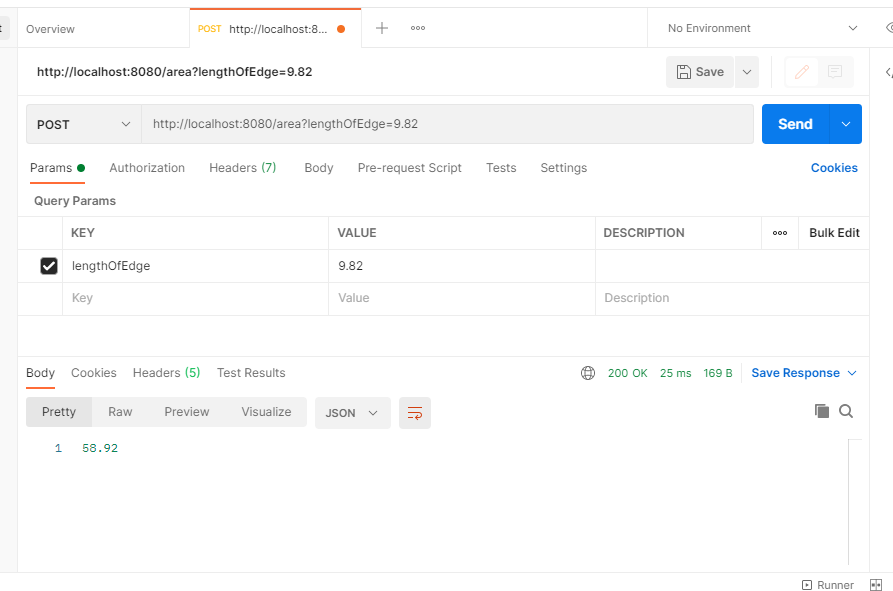
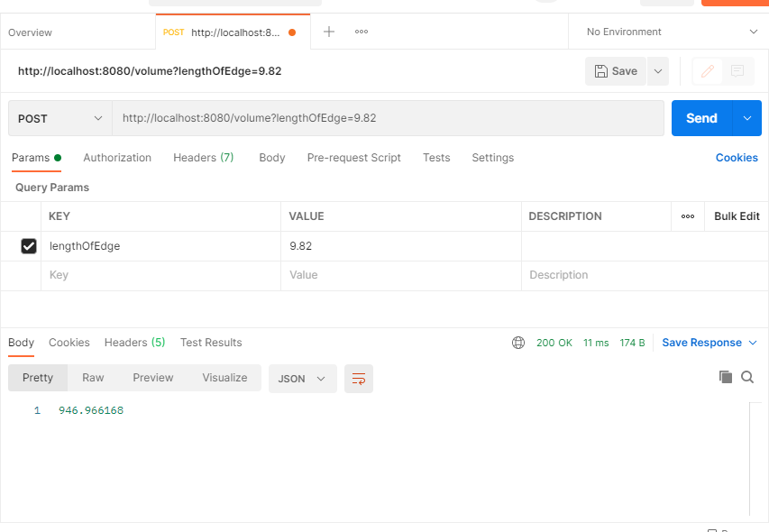
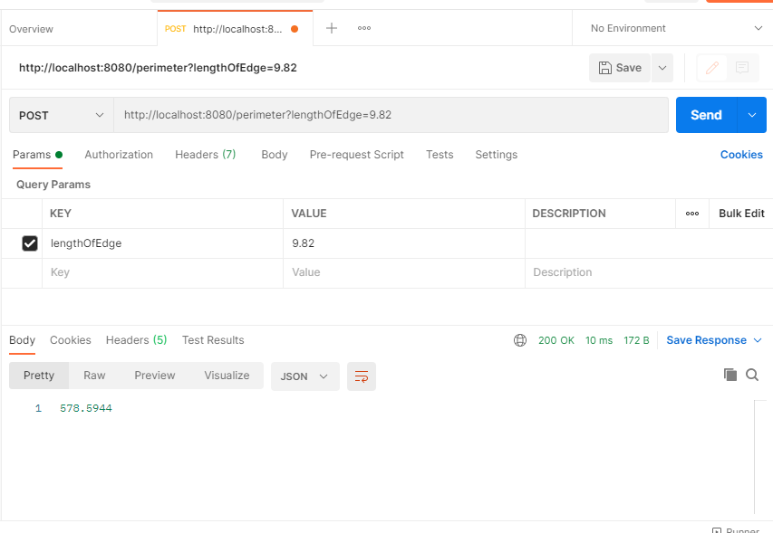

# CubeCalculator_CKH_Ass1_RESTful_API

This is RESTful_API created using SpringBoot.

Objective : To Calculate Area,Volume,Perimter of Cube.

PostMan : Area

PostMan : Volume

PostMan : Perimeter

